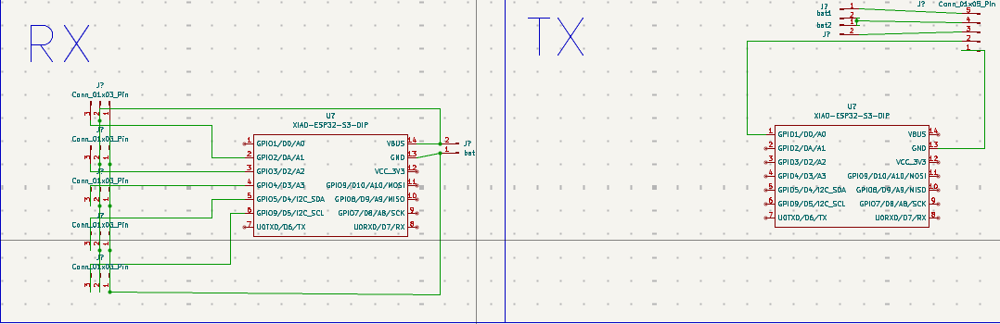
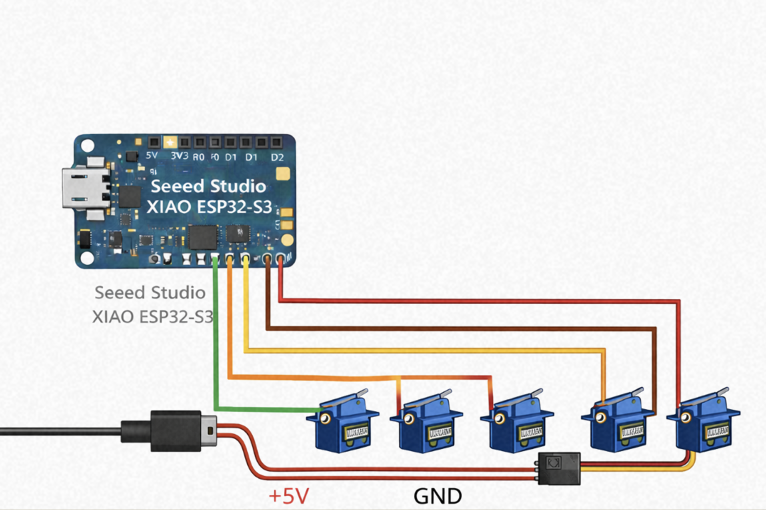
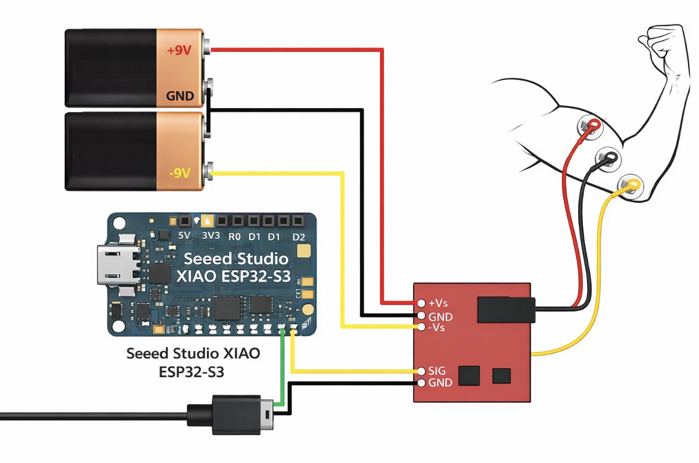

# Esp_Hand
A Bionic Arm with esp 32 and the EMG sensors

I was really fascianted with the emg sensors and i wanted to used it really bad and when the ideation was going on the i found the esp now protocol too which made me more and more excited and wanted to tried both of those and wanted to pack both of those in a single project and started making this.

## Schematics

## CAD

## Bill of Materials (BOM)

| Name                                           | Purpose         | Quantity | Total Cost (USD) | Link | Distributor |
|------------------------------------------------|----------------|----------|------------------|------|-------------|
| 18650 battery                                  | battery        | 1        | 1.29             | https://robocraze.com/products/3-7v-1200mah-18650-battery?_pos=68&_sid=780173d5b&_ss=r | robocraze |
| LM2596 DC-DC Buck Converter Adjustable Step Down Power Supply Module | buck converter | 2        | 0.90             | https://robocraze.com/products/lm2596-dc-dc-buck-module?_pos=36&_sid=40022ae18&_ss=r | robocraze |
| jumper wires                                   | wires          | 1        | 0.45             | https://robocraze.com/products/jumper-wires-20cm-40pcs?_pos=3&_sid=ead2c6eaf&_ss=r | robocraze |
| 3d printed comps                               | hand           | 1        | 0.00             | - | printing legion |
| MG995 High Speed Servo Motor(180 Degree)       | motors         | 5        | 16.10            | https://robocraze.com/products/mg995-servo-motor?_pos=2&_sid=720be0b4a&_ss=r | robocraze |
| Seeed Studio XIAO ESP32C3                      | microcontroller| 2        | 12.88            | https://robocraze.com/products/seeed-studio-xiao-esp32c3?variant=46039428365650&country=IN&currency=INR&utm_medium=product_sync&utm_source=google&utm_content=sag_organic&utm_campaign=sag_organic | robocraze |
| Advance Technologies EMG Muscle Sensor V3.0 With Cable And Electrodes | electrodes     | 1        | 12.75            | https://robu.in/product/advance-technologies-emg-muscle-sensor-v3-0-with-cable-and-electrodes/ | robu |
